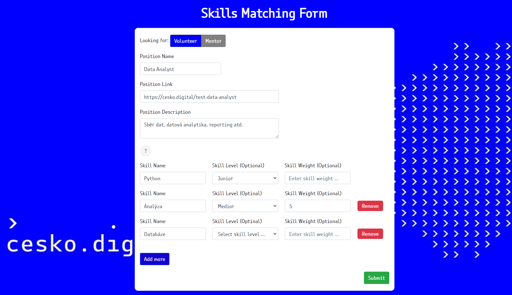
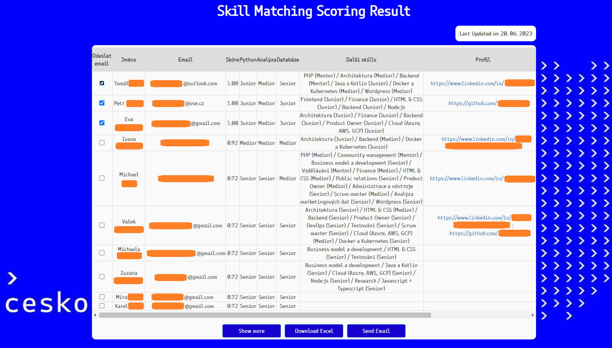

# Skills Matching Web Application for Česko.Digital

<b>Team:</b>
- **Team Leader**: [Peter Kachnič](https://www.linkedin.com/in/peterkachnic/)
- **Main Developer**: [Petr Nguyen](https://www.linkedin.com/in/petr-ngn/)
- **Developer**: [Eva Schwarzová](https://www.linkedin.com/in/eva-schwarzová-8006551a8/)
- **Data Engineer**: [Karolína Benkovičová](https://www.linkedin.com/in/karolina-benkovicova-460/)
- **Project Management**: [Adrián Harvan](https://www.linkedin.com/in/adrian-harvan/)

Our team has a developed web application for skill matching and scoring of volunteers within project engagement and recruiting for IT non-profit organization [Česko.Digital](https://cesko.digital/). Such project was developed within the [DATA CHALLENGE 2023](https://dataproject.vse.cz/) by [FIS VŠE](https://fis.vse.cz/), where our team ended up between the finalists and achieved the 3rd place (see the livestream recordings of the [semifinal presentation](https://www.youtube.com/live/ag7HWc3_isY?feature=share&t=11216) and the [final presentation](https://www.youtube.com/live/ag7HWc3_isY?feature=share&t=22472)).

## High-level architecture
The web application was built with Flask framework under ```Python 3.9.16```. It has a real-time connection to Snowflake database of Česko.Digital, where the tables are integrated with ETL tool Keboola, which integrates several data sources such as Slack and Airtable. Nonetheless, this repository regards only the web application itself, thus, Snowflake, Keboola and data sources' architectures are omitted.

The home page displays a login page, where the application user inserts his credentials:
<p align="center">
   
</p>

Afterwards, the application requires to choose and fill in the form, which consists of following features:
- Choose whether we want to look for a volunteer or mentor.
- Insert information about the position, such as a position name, position link and position description - this information will be input into the email template.
- Fill in the skill name (out of 41 skills) and optionally the skill level (junior, medior, senior or mentor) and skill weight for penalization of mismatches, or in other words, if we prefer one skill over another. We can also add another skills if required.
- Additionally, the page also shows a little hint button (with a question mark), which displays a page of all listed skills and their domains.
<p align="center">
   
</p>

Subsequently, a custom scoring algorithm will be run in the background and return an output result table which includes the users' names, email addresses and their scores as well as their skill dispositions, URL profile links and many others. An application user may also download the result table as an Excel file in order to filter it according to his preferences.
- The table also includes checkboxes via which we select the users to whom we want to send an email, which will be done via the <i>Send email</i> button.
<p align="center">
   
</p>

The app will open a new Gmail email page, where all the position information is input into the prepared email template, namely into the email subject and email body, and the emails of selected users are inserted into hidden copy / blind carbon copy (Bcc.). Before sending an email, an application user can adjust the email according to his preferences, add more recipients, attachments, adjust the body etc.
<p align="center">
   
</p>

## Repository structure

```
├── web_app/
│    │
│    ├── inputs/
│    │     ├── .env
│    │     ├── config.yaml
│    │     ├── email.txt
│    │     ├── skills_map.json
│    │     
│    ├── static/
│    │     ├── css/
│    │     │     ├── fonts.css
│    │     │     ├── form.css
│    │     │     ├── login.css
│    │     │     ├── result.css
│    │     │     ├── skill.css
│    │     │
│    │     ├── fonts/
│    │     │     ├── cesko.digital-regular.woff
│    │     │     ├── cesko.digital-regular.woff2
│    │     │
│    │     ├── js/
│    │     │     ├── form.js
│    │     │     ├── result.js
│    │     │     ├── skills_options.js
│    │     │
│    │     ├── pic/
│    │           ├── cd-logo.png
│    │           ├── czechia-map-arrows.png
│    │           ├── visual.jpg
│    │
│    ├── templates/
│    │     ├── form.html
│    │     ├── login.html
│    │     ├── result.html
│    │     ├── skills.html
│    │
│    ├── app.py
│    ├── package-lock.json
│    ├── package.json
│    ├── requirements.txt
│    ├── serverless.yml
│
├── .gitignore
├── README.md
├── requirements.txt
```
- ```requirements.yml``` (conda packages) / ```requirements.txt``` (pip packages)
- ```package-lock.json```, ```package.json```, ```serverless.yml``` - configuration for AWS Lambda deployment
- ```app.py``` - Backend of web application using Flask framework
- ```templates/``` - HTML templates
- ```static/``` - Fonts, images, CSS and JavaScript scripts
- ```inputs/``` - ```.env``` (credentials) , ```config.yaml``` (data frame operations' input parameters), ```email.txt``` (email template), ```skill_map.json``` (skill column names and names with diacritics)

## Scoring Methodology

We calculate the score between the required input from the form vs. all the users. Hence, we calculate the score between the baseline $b$ and comparison $c$.

First, we calculate the cosine similarity score of skills' occurrences between the baseline and comparison, hence we score whether the users have the required skill(s) (1) or not (0). We calculate the cosine similarity score as a dot product of $\mathbf{b}$ and $\mathbf{c}$ vectors divided by the product of their Euclidean norms:
$$\cos\left(b, c\right) = \frac{\mathbf{b} \cdot \mathbf{c}}{\|\|\mathbf{b}\|\| \|\mathbf{c}\|\|}$$

Afterwards, we exclude all the users with a zero cosine similarity score, meaning we filter out all the users that do not have any skills we require and keep only those users which have at least one skill we require.

Then we encode the skills' levels from string to numeric. If the skill level is filled in within the form for the given skill (```col```), then all the users having the required skill level for the given skill will have zero value, which ensures zero distance and a perfect similarity score w.r.t. given skill. For instance, if we are looking for Python mediors, all the Python mediors will have the perfect score.
- For the other skill levels which do not match the required skill level, it holds that the nearest highest level has a lower value (i.e., a lower distance and a higher score) than the nearest lower level. For instance, if we are looking for Python mediors, all the Python seniors will have a higher score than the Python juniors. In other words, in cases of mismatch, we prefer more skilled users to less skilled ones.
-It also holds that if the skill level is filled in, then users with a missing skill level will have the lowest scores. We also distinguish between those who have a missing skill level but a non-missing skill (```N/A level```) and those who have both a missing skill level and a skill (```X```). The latter one will have the lowest score out of all cases and this case holds, when we require more than one skill.
- If the skill level is not filled in, we do not prefer any skill level, just the skill itself. Hence, all the users who have an available skill level or have a missing skill level but a non-missing skill will have zero value, which results in a perfect score.
- If the skill level is not filled in, we do not prefer any skill level, just the skill itself. Hence, all the users who have an available skill level or have a missing skill level but a non-missing skill will have zero value, which results in a perfect score.
Optionally, we can also set a weight which can be any positive value. Such weight penalizes the disimilarity, i.e., the mismatches in the distance calculations, hence it will decrease the final scores. Though, it will not affect the perfect matches, which is desired. By default, the weight is set to 1 and higher weights will impose higher penalization for disimilarity.
```python
if level == 'junior':
    df_skills[col] = weight * df_skills[col].replace({'junior': 0, 'medior': 0.25,'senior': 0.5, 'mentor': 0.75,
                                                        'N/A level': 1, 'X': 3})
elif level == 'medior':
    df_skills[col] = weight * df_skills[col].replace({'junior': 0.5, 'medior': 0, 'senior': 0.25, 'mentor': 0.75,
                                                        'N/A level': 1, 'X': 3})
elif level == 'senior':
    df_skills[col] = weight * df_skills[col].replace({'junior': 0.75, 'medior': 0.5, 'senior': 0, 'mentor': 0.25,
                                                        'N/A level': 1, 'X': 3})
elif level == 'mentor':
    df_skills[col] = weight * df_skills[col].replace({'junior': 0.75, 'medior': 0.5, 'senior': 0.25, 'mentor': 0,
                                                        'N/A level': 1, 'X': 3})
else:
    df_skills[col] = [weight * 3 if i == 'X' else 0 for i in df_skills[col]]
```

Afterwards, we perform distance calculations between the baseline's encoded skills' levels and the users' (comparison) encoded skills' levels. In particular, we calculate 3 distance metrics: Euclidean, Manhattan and Mahalanobis. The latter one also captures the linearity between the skills' levels themselves. Such distances are calculated as follows, where $n$ are number of required skills, and $C$ is the covariance matrix of encoded skills' levels, and return positive values:

$$d_{Euclidean} \left(b, c\right) = \sqrt{{\sum}_{i=1}^{n} \left(b_i - c_i\right)^2}$$

$$d_{Manhattan} \left(b, c\right) = {\sum}_{i=1}^{n} \left|b_i - c_i\right|$$

$$d_{Mahalanobis} \left(b, c\right) = \sqrt{(b-c)^T \times C^{-1} \times (b-c)}$$

Instead of using absolute (cumulative) distances, we are taking average distances into account, which are calculated as the absolute distance normed by the number of required skills.

$$\overline{d_i} = \frac{d_i}{n}$$

Instead of using distances, we adjust them into similarity scores by taking their inverses. Hence, if the distance is zero (on average), then the score will be perfect, i.e., 100 %.

$$\overline{d_i}^{-1} = \frac{1}{\overline{d_i}+1}$$

The final score is determined as an average of those inverses of average distances, which ensures more robust and unbiased scoring estimates.
- Note that if we require only 1 skill without any required level, hence the score will be calculated without Mahalanobis distance and will be 1 for all the filtered users in the result table.
    - The Mahalanobis distance cannot be calculated in this case, since it's covariance matrix will be singular, i.e., its inverse cannot be defined due to the zero determinant.
    - All the filtered users in the output will have a score of 1. Since we exclude all the users who do not have any required skills, hence all the users in the output will have a given skill regardless of the level (i.e., there will be no mismatch), therefore they will all have a score of 1.

$$MatchScore =  \frac{1}{N} {\sum}_{i=1}^{N} \overline{d_i}^{-1}$$
